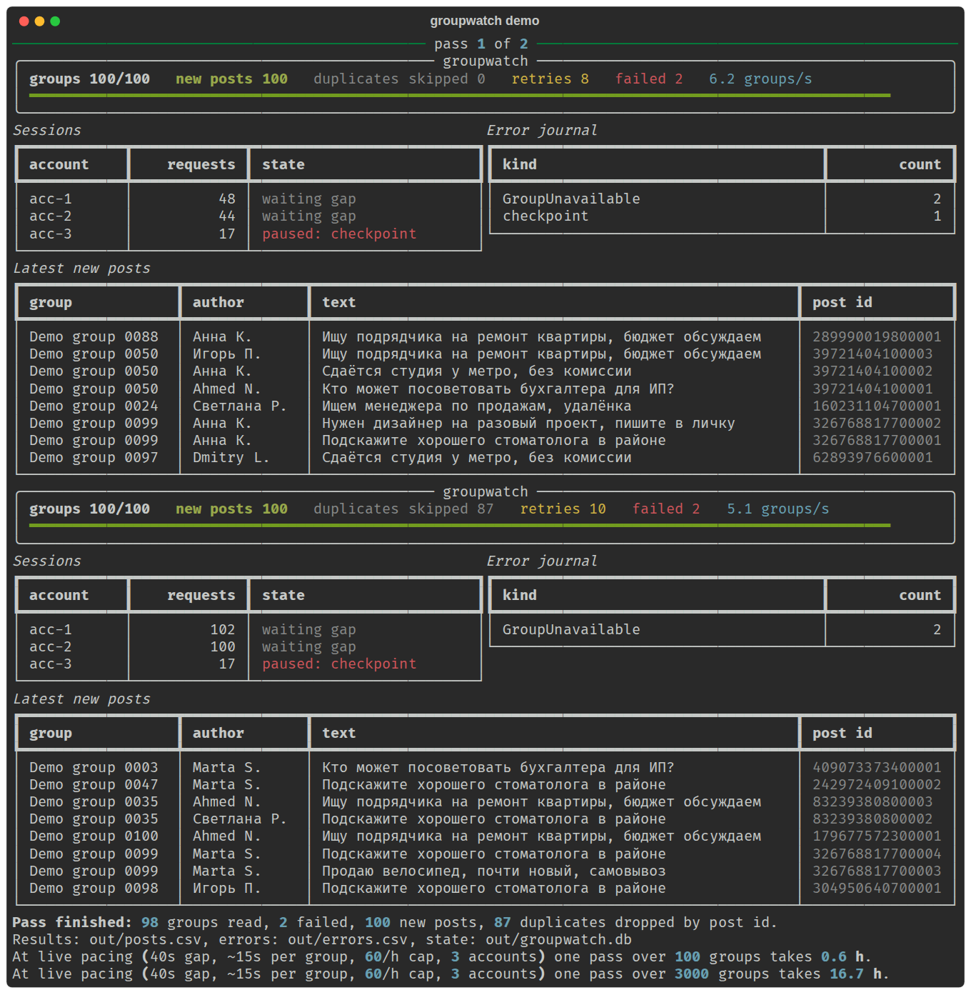

# groupwatch

[English](./README.md)

Мониторинг новых постов в группах Facebook с выгрузкой в CSV или Google
Таблицу. Рассчитан на тысячи групп. На таком объёме сложность не в парсинге, а в
том, чтобы аккаунты не отваливались. Поэтому каждый заход идёт через очередь с
паузами и пул живых браузерных сессий, а любая ошибка пишется в журнал, а не
тихо останавливает мониторинг.



## Как устроено

```
groups.csv ──> очередь ──> пул аккаунтов ──> браузерная сессия ──> дедуп по id поста ──> CSV / Google Таблица
                  ^              │
                  └── повтор ────┘──> журнал ошибок (группа не открылась, аккаунт на паузе)
```

- **Список групп.** Таблица `url,name,accounts`. В `accounts` указано, какие
  аккаунты состоят в группе. Закрытую группу открывает только аккаунт, который её
  видит.
- **Очередь и воркеры.** По одному воркеру на сессию. У каждого аккаунта своя
  пауза между заходами (по умолчанию 40 с ± 30%) и лимит в час (60).
- **Браузерные сессии.** Playwright, у каждого аккаунта постоянный профиль
  Chromium. Вход один раз вручную (`groupwatch login acc-1`), дальше профиль
  переиспользуется, и Facebook каждый раз видит то же устройство. Официальный API
  не используется, к лентам групп он доступа не даёт.
- **Чекпоинты.** Если Facebook перекидывает сессию на проверку или логин,
  аккаунт ставится на паузу и попадает в журнал, а группа уходит в очередь другому
  аккаунту. Проверку инструмент не обходит: человек подтверждает аккаунт, и тот
  возвращается в работу.
- **Дедупликация.** Ключ поста это id из его ссылки, хранится в SQLite. Группу
  можно обходить сколько угодно раз, в таблицу попадают только новые посты.
- **Результат.** Лист `posts`: время сбора, группа, автор, текст, ссылка, id.
  Лист `errors`: время, группа, аккаунт, тип, подробности.

## Попробовать

```bash
uv sync
uv run groupwatch demo            # 100 групп, 3 сессии, 2 прохода, без интернета
uv run pytest
```

Демо прогоняет весь конвейер (очередь, паузы, чекпоинт на одном аккаунте,
недоступные группы, повторы, дедуп между проходами, выгрузка в CSV) на
симулированном источнике, аккаунты не нужны. В конце печатает, сколько займёт
один проход при реальных паузах.

## Боевой запуск

```bash
uv sync --extra live --extra sheets
uv run playwright install chromium
uv run groupwatch login acc-1     # войти и закрыть окно
uv run groupwatch run --groups examples/groups.csv --accounts acc-1,acc-2 \
    --sheet <ключ-таблицы> --credentials credentials.json --loop 600
```

Скорость задают паузы, а не код. При паузе 40 с и ~15 с на группу один аккаунт
читает около 60 групп в час. 3000 групп на 10 аккаунтах дают полный проход
примерно за 5 часов. Сборщик открывает ленту группы в хронологическом порядке и
находит посты по их ссылкам. Селекторы проверяются на пилоте на реальных группах,
до масштабирования.
